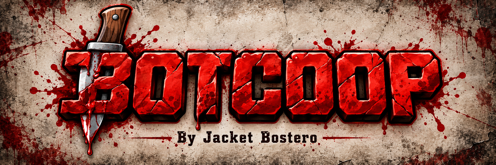
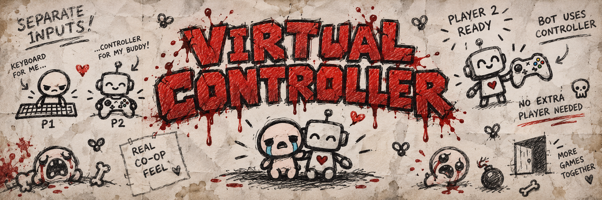
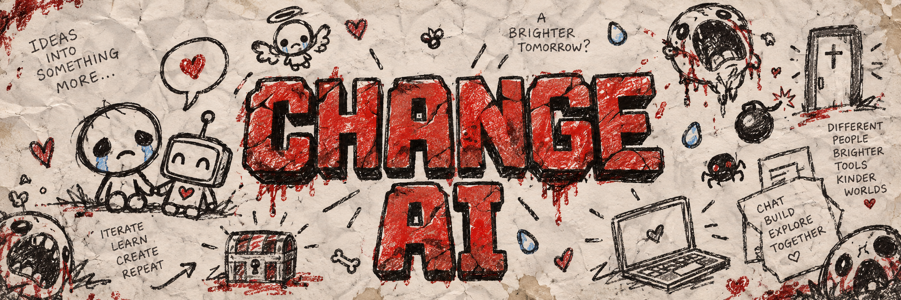

<p align="center">
  
</p>

<h1 align="center">BOT CO-OP</h1>

<p align="center">
  <strong>An autonomous co-op companion for The Binding of Isaac.</strong>
</p>

<p align="center">
  Lua • Python • Autonomous Combat • Voice Commands • LLM Integration • Virtual Controller
</p>

---

## About

**Bot Co-op** is an experimental autonomous second-player system for **The Binding of Isaac**.

Instead of requiring another real player, the mod creates a computer-controlled companion capable of following Player 1, fighting enemies, avoiding hazards and reacting to what is happening during a run.

The project also includes an optional Python layer that adds:

- Voice commands
- Speech recognition
- Text-to-speech
- AI-generated reactions
- Natural-language actions
- Virtual controller support

The goal is simple:

> **Turn Isaac's local co-op into a playable experience with an autonomous companion.**

---

## 🚧 Current Status

**Bot Co-op is currently being updated.**

The core systems already exist, but the project is being cleaned up and updated for newer versions of the game.

Gameplay GIFs and new screenshots will be added after the next version of the mod is ready.

---

# Features

## 🤖 Autonomous Companion

The bot operates as an independent Player 2.

It can:

- Follow Player 1
- Detect enemies
- Select targets automatically
- Aim independently
- Shoot automatically
- Approach distant enemies
- Retreat from nearby enemies
- Maintain combat distance
- Follow the player when the room is safe

---

## 💀 Hazard Awareness

The bot includes basic environmental awareness and tries to avoid dangerous objects.

It can react to:

- Enemy projectiles
- Bombs
- Fireplaces
- Rocks
- Pits
- Spikes
- Grid obstacles
- Dangerous combat positions

The movement system combines its current objective with repulsion forces generated by nearby hazards.

---

## 🎁 Smart Pickup Behaviour

The companion will not automatically steal important collectibles from Player 1.

By default, collectibles are treated as objects that should be avoided.

When you want the bot to grab an item, use:

```text
J
```

This gives Player 1 control over which character receives important items.

---

# How It Works

Bot Co-op is divided into three main layers:

```text
┌─────────────────────────────┐
│   The Binding of Isaac      │
└──────────────┬──────────────┘
               │
      ┌────────▼─────────┐
      │    Lua Bot AI    │
      │                  │
      │ Movement         │
      │ Combat           │
      │ Targeting        │
      │ Avoidance        │
      │ Pickups          │
      └────────┬─────────┘
               │
               │ Game State
               ▼
      ┌──────────────────┐
      │  Python Bridge   │
      │                  │
      │ Voice            │
      │ LLM              │
      │ TTS              │
      │ Commands         │
      └────────┬─────────┘
               │
               │ Inputs
               ▼
      ┌──────────────────┐
      │ Virtual Xbox Pad │
      │     Player 2     │
      └──────────────────┘
```

The important distinction is that the bot's gameplay does **not** depend on an LLM.

Movement, combat, aiming and hazard avoidance are handled directly by Lua.

The language model is only used as an optional communication and high-level command layer.

---

# Lua Gameplay AI

The main gameplay logic lives inside:

```text
main.lua
```

This system is responsible for:

- Player 2 movement
- Following Player 1
- Enemy detection
- Target selection
- Automatic shooting
- Combat positioning
- Hazard avoidance
- Pickup protection
- Bot-specific actions
- Exporting game information

Because the actual gameplay logic runs in Lua, the companion can continue moving and fighting even without the external AI layer.

---

# Controls

| Key | Action |
|:---:|---|
| `B` | Spawn the autonomous companion |
| `J` | Allow the bot to collect the nearest pickup |
| `T` | Hold to speak to the AI companion |
| `F5` | Bot uses a bomb |
| `F6` | Bot uses its active item |
| `F7` | Bot uses a card or pill |

---

## Spawning Player 2

Start a normal run and press:

```text
B
```

The mod will create Player 2 and the autonomous Lua AI will begin controlling it.

---

# Gameplay

A full gameplay demonstration is currently being prepared.

The final demo will show:

- Player following
- Automatic enemy detection
- Independent aiming
- Autonomous combat
- Projectile avoidance
- Item protection
- Bomb usage
- Active item usage
- Voice commands
- AI reactions

<!--

When the gameplay GIF is ready, create:

assets/gifs/gameplay.gif

Then replace this comment with:

<p align="center">
  
</p>

-->

---

<p align="center">
  
</p>

# Installation & Setup

## Requirements

### Core Mod

- The Binding of Isaac
- Mod support enabled

### Python Features

- Python 3.8+
- Internet connection for external AI providers
- Microphone for voice commands

### Recommended

- Repentance / Repentance+
- REPENTOGON
- ViGEmBus

The Python components are optional.

The Lua gameplay bot can work independently.

---

## 1. Download Bot Co-op

Clone the repository:

```bash
git clone https://github.com/Joaquin-Galle-ui/BotCoop-TheBindingofIsaac.git
```

Or download the project as a ZIP.

---

## 2. Install the Isaac Mod

The game needs access to:

```text
main.lua
metadata.xml
```

Place the mod inside your Isaac mods folder.

Example:

```text
mods/
└── BotCoop/
    ├── main.lua
    └── metadata.xml
```

Start Isaac and verify that **Bot Co-op** appears inside the Mods menu.

---

## 3. Install Python Dependencies

Open a terminal inside the project directory and run:

```bash
pip install -r requirements.txt
```

The project currently uses:

```text
vgamepad
keyboard
groq
pyttsx3
SpeechRecognition
PyAudio
```

---

## 4. Configure Isaac's Log File

The optional AI bridge reads game information from Isaac's:

```text
log.txt
```

Inside:

```text
ia_puente.py
```

configure:

```python
ruta_archivo = r"...\log.txt"
```

with the path to your own Isaac log.

It is usually located somewhere inside:

```text
Documents/
└── My Games/
    └── Binding of Isaac Repentance+/
        └── log.txt
```

The exact location may vary depending on your installation.

---

## 5. Configure the AI API Key

The current version uses **Groq**.

Inside:

```text
ia_puente.py
```

locate:

```python
GROQ_API_KEY = "APY_KEY_HERE"
```

and replace the placeholder with your own API key.

> ⚠️ **Never upload a real API key to GitHub.**

A future version will move this configuration into environment variables.

---

## 6. Start The Binding of Isaac

Launch the game normally.

Make sure Bot Co-op is enabled and start a run.

---

## 7. Start the AI Bridge

If you want voice commands and AI reactions:

```bash
python ia_puente.py
```

The application will initialize the microphone and begin watching Isaac's game state.

When ready, hold:

```text
T
```

and speak.

---

<p align="center">
  
</p>

# Virtual Controller

Bot Co-op includes an optional virtual controller layer.

The script:

```text
mando_virtual.py
```

creates a virtual **Xbox 360 controller** for Player 2.

This allows Isaac to treat the bot more like a real local co-op player.

---

## Why Use a Virtual Controller?

The Binding of Isaac normally expects Player 2 to have a separate input device.

Without one, some co-op systems may not behave correctly.

Using a virtual controller helps separate:

```text
Player 1
Keyboard / Real Controller
```

from:

```text
Player 2
Virtual Xbox Controller
```

This helps preserve separate:

- Player state
- HUD elements
- Health
- Active items
- Cards
- Bomb usage
- Co-op input

---

## Start the Virtual Controller

Run:

```bash
python mando_virtual.py
```

You should see something similar to:

```text
Mando de Xbox 360 virtual conectado exitosamente!
```

Keep the script running while playing.

---

## ViGEmBus

The virtual controller uses:

```text
vgamepad
```

which depends on the ViGEm virtual controller driver on Windows.

If the virtual Xbox controller cannot be created, verify that ViGEmBus is installed correctly.

---

## No Extra Player Required

You do not need:

- A second physical controller
- Another keyboard
- Another person

Player 1 keeps playing normally.

The bot gets its own virtual controller.

---

<p align="center">
  
</p>

# AI Companion

The Python bridge adds an optional conversational AI layer.

This allows Player 2 to:

- Hear voice commands
- Generate short responses
- React to events
- Use text-to-speech
- Trigger predefined gameplay actions

The AI receives information about the current run and can react accordingly.

---

## Available Game Context

The Lua mod can export information such as:

```text
Player HP
Current room
Enemy count
Boss presence
Visible collectibles
```

Python reads this information and includes it as context when interacting with the language model.

---

# Voice Commands

Hold:

```text
T
```

and speak.

Example:

```text
You:
"Use a bomb."

Bot:
"Bueno, bueno, ahí va la bomba."

System:
BOMBA
↓
F5
```

The language model does not directly control movement.

Instead, it produces high-level commands that are translated into predefined inputs.

---

## Command System

The current command keywords are:

```text
AGARRAR
BOMBA
ACTIVAR
CARTA
```

Python translates them into:

```text
AGARRAR  → J
BOMBA    → F5
ACTIVAR  → F6
CARTA    → F7
```

The flow looks like this:

```text
Voice
  ↓
Speech Recognition
  ↓
Language Model
  ↓
Command Detection
  ↓
Keyboard Input
  ↓
Lua Bot
```

This keeps generative AI separated from frame-to-frame gameplay.

---

# Automatic Reactions

The companion can also react without being directly spoken to.

For example, the AI can react when:

- Player 1 takes damage
- A collectible appears
- Something important changes during the run

The bridge reads the game state, generates a short reaction and plays it using text-to-speech.

This makes the companion feel more like another player rather than just a command interface.

---

# Changing the AI Provider

The current implementation uses:

```text
Groq
```

but the system can be adapted to other providers.

Possible alternatives include:

- OpenAI
- Google Gemini
- Local LLMs
- Other compatible APIs

The important requirement is that the provider can receive context and return text containing the required command keywords when necessary.

---

## Planned Provider Configuration

Future versions could use something like:

```env
AI_PROVIDER=groq
AI_MODEL=...
AI_API_KEY=...
```

instead of editing Python source files manually.

---

# AI Personality

The current companion uses an intentionally informal Argentine personality.

This can be completely customized.

Possible personalities could include:

- Friendly companion
- Serious tactical assistant
- Sarcastic bot
- Chaotic co-op partner
- Isaac-themed character
- Custom fictional personality

The personality does not affect the core gameplay AI.

---

# Project Structure

```text
BotCoop-TheBindingofIsaac/
│
├── assets/
│   ├── Bot-Coop-By-Jacket-Bostero.png
│   ├── Bot-Coop-Banner.png
│   ├── Instalation-&-setup.png
│   ├── Change-AI.png
│   └── Virtual-Controller.png
│
├── main.lua
├── metadata.xml
│
├── ia_puente.py
├── mando_virtual.py
│
├── requirements.txt
├── .luarc.json
└── README.md
```

> `Bot-Coop-Banner.png` is currently kept as an additional artwork but is not used by this README.

---

# File Overview

## `main.lua`

Core gameplay AI.

Handles:

- Movement
- Enemy detection
- Combat
- Shooting
- Following
- Hazard avoidance
- Pickup behaviour
- Player 2 actions
- Game-state exporting

---

## `ia_puente.py`

Optional AI communication bridge.

Handles:

- Game log reading
- AI API interaction
- Voice recognition
- Text-to-speech
- Automatic reactions
- Natural-language commands

---

## `mando_virtual.py`

Creates a virtual Xbox 360 controller for Player 2.

---

## `metadata.xml`

Contains Isaac mod metadata.

---

## `requirements.txt`

Python dependencies used by the external tools.

---

# Design Philosophy

Bot Co-op separates two different kinds of intelligence.

## Gameplay AI

Implemented in Lua.

Responsible for:

```text
Movement
Combat
Aiming
Following
Avoidance
Pickups
```

These systems need fast and deterministic reactions.

---

## Generative AI

Implemented through Python.

Responsible for:

```text
Conversation
Voice interpretation
Personality
Event reactions
High-level commands
```

These systems can tolerate network latency and non-deterministic responses.

This separation avoids using an LLM for decisions that must happen every frame.

---

# Roadmap

## Core Gameplay

- [x] Autonomous Player 2
- [x] Player following
- [x] Enemy detection
- [x] Automatic targeting
- [x] Automatic shooting
- [x] Combat positioning
- [x] Projectile avoidance
- [x] Bomb avoidance
- [x] Obstacle avoidance
- [x] Pickup protection
- [x] Manual bot actions

## AI Companion

- [x] Game-state export
- [x] AI reactions
- [x] Push-to-talk
- [x] Speech recognition
- [x] Text-to-speech
- [x] Natural-language commands
- [x] Groq integration

## Co-op Integration

- [x] Virtual Xbox controller
- [x] Separate Player 2 input
- [x] Independent bot actions

## Planned

- [ ] Update for the latest Isaac version
- [ ] Improve pathfinding
- [ ] Improve projectile prediction
- [ ] Improve boss-specific strategies
- [ ] Better room navigation
- [ ] Automatic Isaac installation detection
- [ ] `.env` configuration
- [ ] Multiple AI providers
- [ ] Configurable personalities
- [ ] Configurable keybinds
- [ ] In-game configuration
- [ ] Improved collectible evaluation
- [ ] Gameplay GIFs
- [ ] Gameplay screenshots
- [ ] Cleaner project architecture
- [ ] Packaged releases

---

# Known Limitations

Bot Co-op is still experimental.

The bot may sometimes:

- Get stuck around complex room geometry
- Choose imperfect combat positions
- React late to extremely fast projectiles
- Struggle with unusual bosses
- Behave incorrectly with specific characters or items

The AI bridge also depends on:

- Internet connection
- Microphone quality
- Speech recognition
- External AI provider availability

The core Lua gameplay bot does not require those systems.

---

# Security

Never commit private API keys.

Before pushing changes, verify that files such as:

```text
ia_puente.py
.env
config files
```

do not contain private credentials.

A future version of the project will use `.env` for sensitive configuration.

---

# Contributing

Ideas, experiments and improvements are welcome.

Interesting areas to improve include:

- Pathfinding
- Projectile prediction
- Boss strategies
- Enemy prioritization
- Collectible evaluation
- AI provider abstraction
- Configuration management
- Isaac version compatibility

Feel free to fork the project and experiment with your own companion.

---

# Disclaimer

Bot Co-op is an unofficial fan project created for experimentation and educational purposes.

It is not affiliated with or endorsed by the developers or publishers of **The Binding of Isaac**.

The Binding of Isaac and all related intellectual property belong to their respective owners.

---

<p align="center">
  <strong>One player. Two characters. Questionable decisions.</strong>
</p>

<p align="center">
  Made with Lua, Python and an irresponsible amount of tears.
</p>
